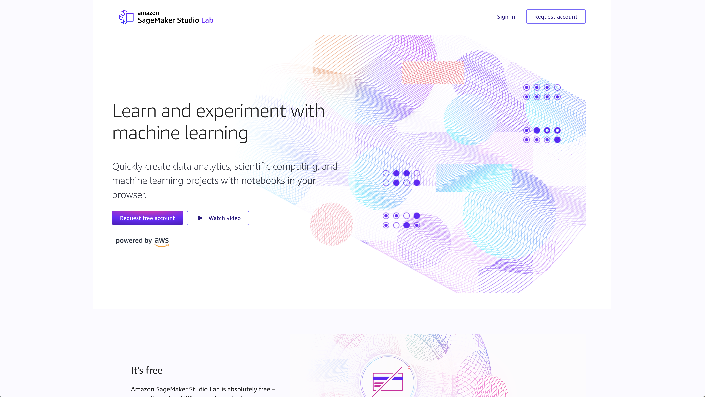
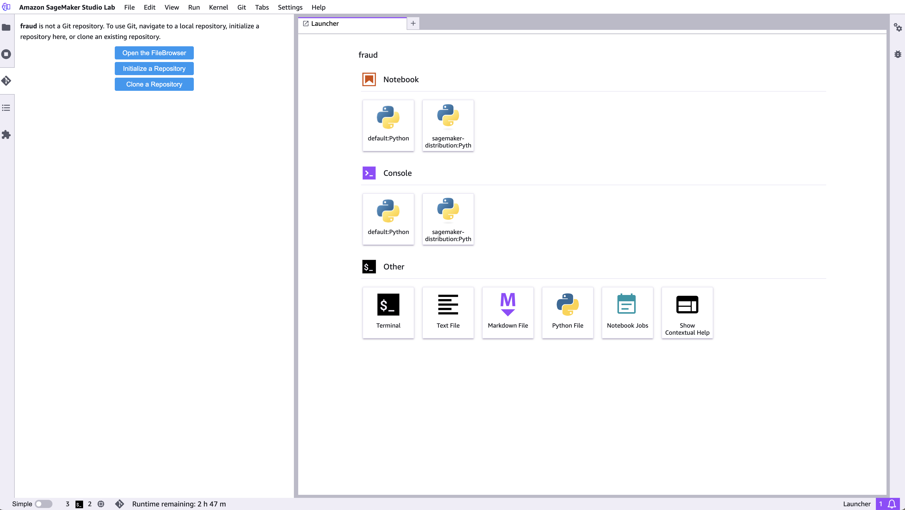
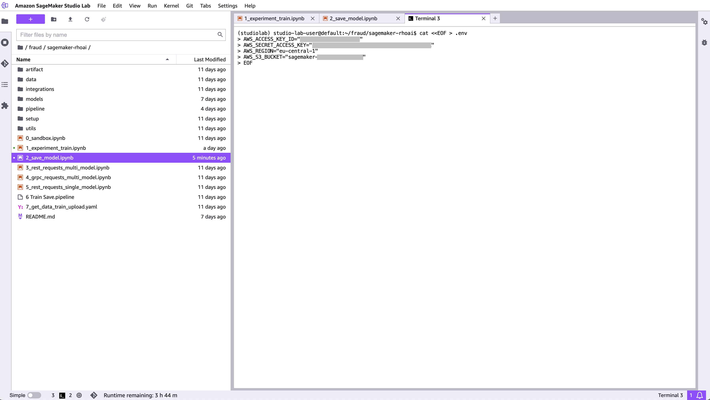

# Sagemaker to RHOAI Fraud Detection

This tutorial is based on: <https://rh-aiservices-bu.github.io/fraud-detection/> but instead of doing all the tasks in Red Hat OpenShift AI it tries to mmimic the scnerio where a Data Scientists develops a model in Sagemaker and then deploys it in OpenShift AI.

There are some differences though:

- It starts in Sagemaker
- It uses Tekton to build the Kubeflow Pipeline (KFP) used to test and deploy the model
- There's a Camel integration that helps moving the model from Amazon Web Services S3 to an on-premise Red Hat OpenShift AI installation
- It uses Gitops to deploy all the components


Picture of the arquitecture and flow.


The simplified flow of the demonstration is as follows:

1. Go to [Sagemaker Studio Lab](https://studiolab.sagemaker.aws). Train and save the model, scaler and test data as a zip file (**evaluation kit**) in an S3 bucket (start).
2. A Camel S3 integration will be triggered every time there's a new **evaluation kit**.
3.
4.
5.
6.
7.
8.
9.


# Preparation

## Adjust minimal .env

Here you are sample `.env` file that should work straight away. Change `REPO_URL` if you have forked this repo and `INSTANCE_NAME` at will or if you want to deploy multiple times in the same cluster.

```sh
cat <<EOF > ./bootstrap/.env
REPO_URL="https://github.com/alpha-hack-program/sagemaker-rhoai.git"
INSTANCE_NAME="fraud-detection"
DATA_SCIENCE_PROJECT_NAMESPACE="${INSTANCE_NAME}-ds"
EOF
```

## AWS S3 access

Yo have to:

- Create a bucket you will use the bucket name later.
- Create ACCESS KEYS and give them all persmissions on the S3 bucket
- Save the AWS access key, secret and region in `./bootstrap/.creds` file.

Adjust and run the next commands to create `./bootstrap/.creds` file.

> **NOTE:** Don't forget to log in using `oc` before running this command. AWS and Minio credentials should be updated!

```sh
. ./bootstrap/.env

MINIO_ENDPOINT=$(oc get route minio-s3 -n ic-shared-minio -o jsonpath='{.spec.host}')
DSPA_URL=https://$(kubectl get route ds-pipeline-dspa -n ${DATA_SCIENCE_PROJECT_NAMESPACE} -o jsonpath='{.spec.host}')

cat <<EOF > ./bootstrap/.creds
AWS_ACCESS_KEY_ID="AK..."
AWS_SECRET_ACCESS_KEY="7S.."
AWS_REGION="eu-central-1"
AWS_S3_BUCKET="sagemaker-models-XYZ"
MINIO_ACCESS_KEY=minio
MINIO_SECRET_KEY=minio123
MINIO_REGION=none
MINIO_ENDPOINT=${MINIO_ENDPOINT}
EVALUATION_KIT_FILENAME=models/evaluation_kit.zip
KFP_PIPELINE_NAMESPACE=${DATA_SCIENCE_PROJECT_NAMESPACE}
KFP_PIPELINE_DISPLAY_NAME=deploy
EOF
```

## Log in Sagemaker Studio

Log in or create an account in https://studiolab.sagemaker.aws.



Then clone this repository.



Open a terminal and run this command.

> **NOTE:** Don't forget to log in using `oc` before running this command. AWS and Minio credentials should be updated!

```sh
cat <<EOF > .env
AWS_ACCESS_KEY_ID="AK..."
AWS_SECRET_ACCESS_KEY="7S.."
AWS_REGION="eu-central-1"
AWS_S3_BUCKET="sagemaker-models-XYZ"
EOF
```



Now open `1_experiment_train.ipynb` and run all the cells. This notebook creates a NN model and trains it with the data in file `./csv/card_transdata.csv`. The model is written to `models/fraud/1/model.onnx`. It also saves the scaler and evaluation data for later testing the model in `artifact` folder.

it's time to compress the `evaluation kit` that is: the model, scaler and evaluation data into `models/evaluation_kit.zip`. Finally the files are saved to the bucket you created in AWS S3.

## Time to deploy our smart rest service for fraud detection in RHOAI

We're going to use ArgoCD to do it. It should be pretty straight forward if:

> **TODO:** Explain how to do this

- Red Hat OpenShift Gitops is installed
- Red Hat OpenShift AI is installed and configured
- All the preparation steps have been executed

To deploy the application run these command:

> **NOTE:** Yo have to be logged in using `oc` and have permissions to create `Application` object in `openshift-gitops` namespace.

```sh
cd bootstrap
./deploy.sh
```

And also this command that creates a secret called `camel-s3-integration-creds` in `${DATA_SCIENCE_PROJECT_NAMESPACE}`:

> NOTE: Don't forget that DATA_SCIENCE_PROJECT_NAMESPACE should be set in `./bootstrap/.env`.

```sh
./setup-creds.sh
```